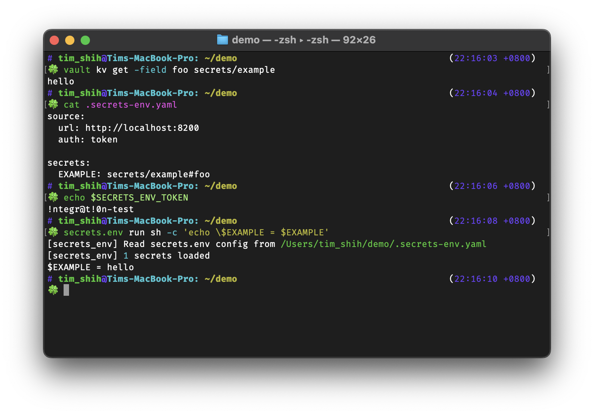

# Secrets.env 🔓

Put secrets from [Vault](https://www.vaultproject.io/) KV engine to environment variables like a `.env` loader, without landing data on disk.

Security is important, but don't want it to be a stumbling block. We love secret manager, but the practice of getting secrets for local development could be a trouble.

This app is built to *plug in* secrets into development without landing data on disk, easily reproduce the environment, and reduce the risk of uploading the secrets to the server.

* 📦 [PyPI](https://pypi.org/project/secrets-env/)
* 📐 [Source code](https://github.com/tzing/secrets.env)
* 📗 [Documentation](https://tzing.github.io/secrets.env/)
