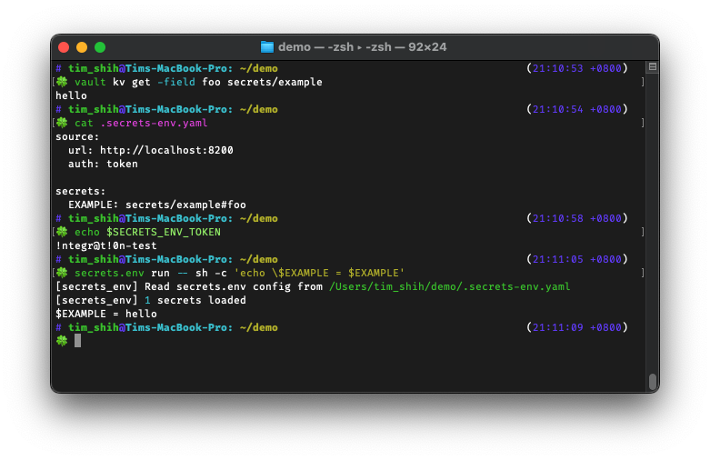

# Secrets.env 🔓

[](https://pypi.org/project/secrets.env/)

[](https://github.com/tzing/secrets.env/actions/workflows/test.yml)

Put secrets from [Vault](https://www.vaultproject.io/) KV engine to environment variables like a `.env` loader, without not landing data on disk.



Security is important, but don't want it to be a stumbling block. We love secret manager, but the practice of getting secrets for local development could be a trouble.

This app is built to *plug in* secrets into development without landing data on disk, easily reproduce the environment, and reduce the risk of uploading the secrets to the server.


## Usage

Install, add config, and run.

### Install

This app is available on [PyPI](https://pypi.org/project/secrets.env/):

```bash
# simple install
pip install secrets.env -E all

# OR add as poetry global plugin
poetry self add secrets.env -E toml
```

Folowing extras avaliable:

* `all` - *install everything below*
* `yaml` - supporting YAML config
* `toml` - supporting TOML config, includes `pyproject.toml`

If none of them are selected, this app only supports the config in JSON format.

### Add config

This app could read vault URL and authentication information from various source:

```bash
export SECRETS_ENV_ADDR='https://example.com'
export SECRETS_ENV_METHOD='token'
export SECRETS_ENV_TOKEN='example-token'
```

But we must list the desired secret path and key in the config file:

```json
{
  "secrets": {
    "EXAMPLE": {
      "path": "secrets/example",
      "key": "foo"
    }
  }
}
```

**Read 'Configure' section below for more details.**

### Run

This app could be used as a command line tool, or a [poetry plugin](https://python-poetry.org/docs/master/plugins/).

* As a CLI tool

  ```bash
  secrets.env run -- some-app-that-needs-secret --args foo bar
  ```

  It loads the secrets, run the command, then forget the secrets.

* As a poetry plugin

  ```bash
  poetry run some-app-that-needs-secret --args foo bar
  ```

  This app will pull the secrets from vault on poetry command [run](https://python-poetry.org/docs/cli/#run) and [shell](https://python-poetry.org/docs/cli/#shell).


## Configure

### Configuration file

This app searches for the file that matches following names in the current working directory and parent folders, and load the config from it. When there are more than one exists, the first one would be selected according to the order here:

1. `.secrets-env.toml`[^1]
2. `.secrets-env.yaml`[^2]
3. `.secrets-env.yml`[^2]
4. `.secrets-env.json`
5. `pyproject.toml`[^1]

[^1]: TOML format is only supported when either [tomllib](https://docs.python.org/3.11/library/tomllib.html) or [tomli](https://pypi.org/project/tomli/) is installed.
[^2]: YAML format is only supported when [PyYAML](https://pypi.org/project/PyYAML/) is installed.

An example config in YAML format:

```yaml
# `source` configured the connection info to vault.
# All values in this section could be overwritten by environment variable, so
# it is possible to run secrets.env app without this section.
source:
  # Address to vault
  # Could be replaced using environment variable `SECRETS_ENV_ADDR` or `VAULT_ADDR`
  url: https://example.com/

  # Authentication info
  # Schema for authentication could be complex, read section below.
  auth:
    method: okta
    username: user@example.com

  # Transport layer security (TLS) configurations.
  # All keys under this section are optional.
  tls:
    # Server side certificate for verifying responses.
    ca_cert: /path/ca.cert

    # Client side certificate for communicating with vault server.
    client_cert: /path/client.cert
    client_key: /path/client.key

# `secrets` lists the environment variable name, and the path the get the secret value
secrets:
  # The key (VAR1) is the environment variable name to install the secret
  VAR1:
    # Path to read secret from vault
    path: kv/default

    # Path to identify which value to extract, as we may have multiple values in
    # single secret in KV engine.
    # For nested structure, join the keys with dots.
    key: example.to.value

  # Syntax sugar: path#key
  VAR2: "kv/default#example.to.value"
```

> For most supported file format, they shared the same schema to this example. The only different is [`pyproject.toml`](./example/pyproject.toml) format- each section must placed under `tool.secrets-env` section.
> Visit [example folder](./example/) to read the equivalent expression in each format.

### Authentication

Vault enforce authentication during requests, so we must provide the identity in order to get the secrets.

*Method*

Secrets.env adapts several authentication methods. You must specify the method by either config file or the environment variable `SECRETS_ENV_METHOD`. Here's the format in config file:

```yaml
---
# standard layout
# arguments could be included in `auth:`
source:
  auth:
    method: okta
    username: user@example.com

---
# alternative layout
# arguments must be avaliable in other source
source:
  auth: token
```

*Arguments*

Auth data could be provided by various source, including:

* **Config file:** Place the config value under `auth` section, use the key provided in the table.
* **Environment variable:** In most cases, environment variable could be used to overwrite the values from config file.
* **Keyring:** We're using [keyring] package to read the values from system keyring (e.g. macOS [Keychain]). For saving a value into keyring, use its [command line utility] with the system name `secrets.env`:

  ```bash
  keyring get secrets.env token/:token
  keyring set secrets.env okta/test@example.com
  ```

  [keyring]: https://keyring.readthedocs.io/en/latest/
  [Keychain]: https://en.wikipedia.org/wiki/Keychain_%28software%29
  [command line utility]: https://keyring.readthedocs.io/en/latest/#command-line-utility

* **Prompt:** If no data found in all other sources, it prompts user for input. You can disable it by setting environment variable `SECRETS_ENV_NO_PROMPT=True`.

#### Supported methods

Here's the argument(s), their accepted source, and corresponding keys.

##### method: `token`

| key   | config file | environment variable               | keyring        | helper |
| ----- | ----------- | ---------------------------------- | -------------- | ------ |
| token | ⛔️          | `SECRETS_ENV_TOKEN`, `VAULT_TOKEN`  | `token/:token` | ✅     |

*[Token helper](https://www.vaultproject.io/docs/commands/token-helper)*: Vault CLI stores the generated token in the `~/.vault-token` file after authenticated. This app reads the token from that file, but it do not create one on authenticating using this app.

To use the helper, you can use command [`vault login`](https://www.vaultproject.io/docs/commands/login) to create one.

##### method: `okta`

| key      | config file | environment variable   | keyring               | prompt |
| -------- | ----------- | ---------------------- | --------------------- | ------ |
| username | `username`  | `SECRETS_ENV_USERNAME` | `okta/:username`      | ✅     |
| password | ⛔️          | `SECRETS_ENV_PASSWORD` | `okta/YOUR_USER_NAME` | ✅     |
