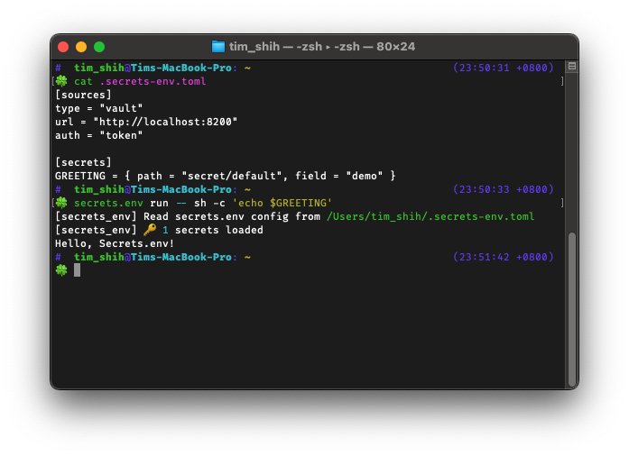

Secrets.env
===========

Secrets.env connects the credential store to your app.

Safeguard your sensitive data by securely retrieving and injecting credentials into your environment variables.
Just like a ``.env`` loader, but without landing credentials on disk.

We understand the importance of secret management services, but also recognize the challenges they can pose for local scripts.
Our solution is designed to effortlessly weave secrets into your workflow, without the risk of storing data on disk.

Enjoy the ease of replicating environments and significantly reduce the risk of accidental secret exposure.
We're here to make your progress unhindered, while keeping security at the forefront.

Table of Contents
-----------------

.. toctree::
   :caption: User Guide
   :maxdepth: 1

   introduction
   configurations
   commands

.. toctree::
   :caption: Providers
   :maxdepth: 1

   provider/plain
   provider/teleport
   provider/vault
   provider/experimental

.. toctree::
   :caption: Advanced Features
   :maxdepth: 1

   advanced/keyring
   advanced/poetry
   advanced/teleport

.. toctree::
   :caption: Other
   :maxdepth: 1

   changelog
